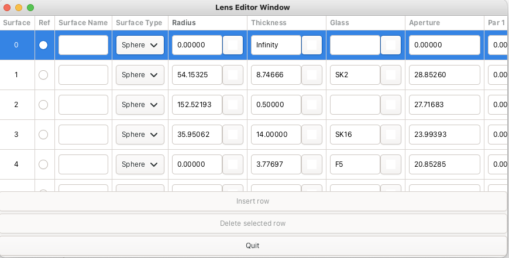
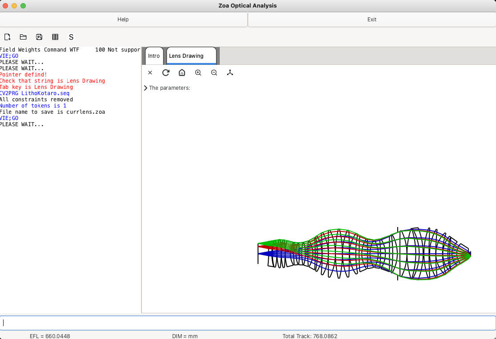
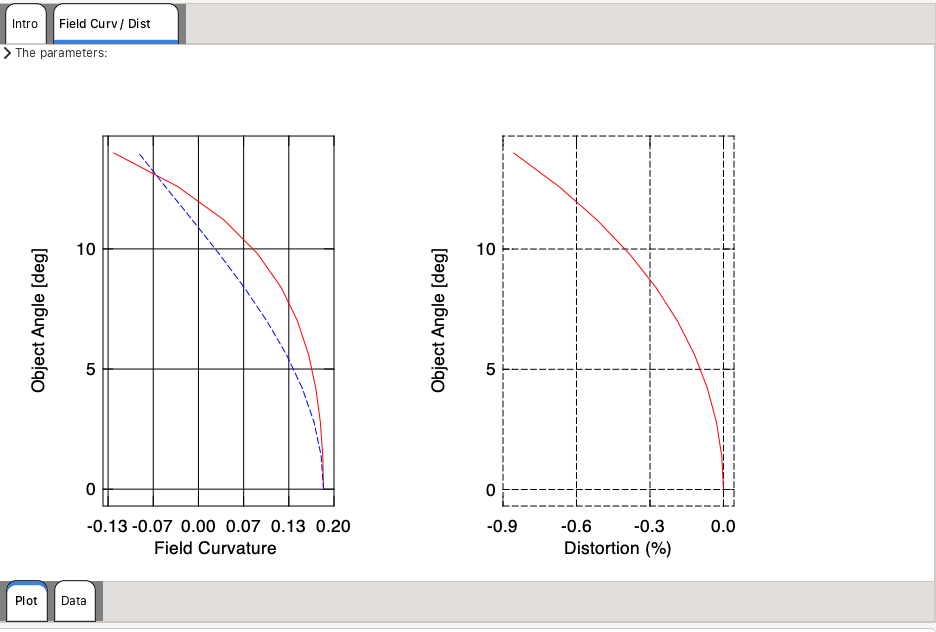
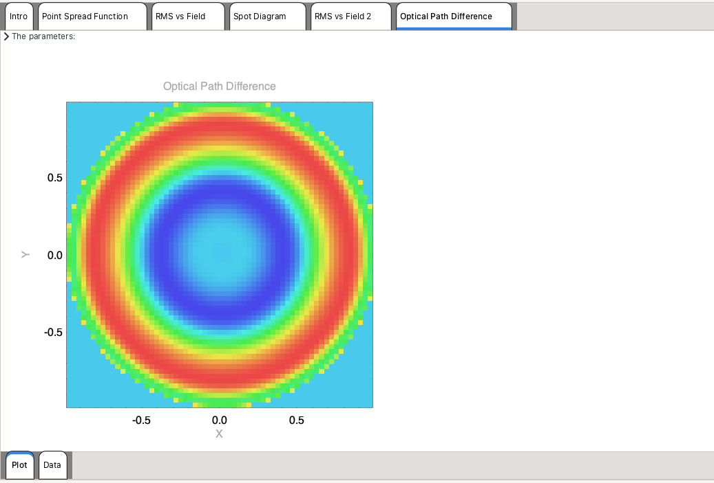

# Zoa

**A free, cross-platform optical design and analysis program.**

Zoa is a desktop optical design tool for laying out lens systems, tracing rays,
analyzing image quality, and optimizing designs — with both an interactive GUI
and a scriptable command language. It runs entirely on open-source
packages (GTK4 + PLplot), so anyone can build it, extend it, and fix it.

> ⚠️ Zoa is **beta** software under active development. Expect rough edges, and
> please back up your work. Bug reports and feature requests are very welcome in
> the [issue tracker](https://github.com/jeremynesbitt/zoa/issues).

---

## Screenshots

| Lens editor | Lens drawing |
| --- | --- |
|  |  |

| Analysis plots (1) | Analysis Plots (2) |
| --- | --- |
|  |  |

---

## Features

- **Interactive lens editor** (GTK4) with per-surface variables, pickups, and solves
- **Lens drawing** in multiple orientations, with Zemax-style surface
  highlighting and a cursor-hover global-coordinate readout.
- **Analysis** paraxial and real-ray trace, ray fans, spot
  diagrams, MTF, PSF, OPD/wavefront, Zernike coefficients, and third-order
  (Seidel) aberrations. Every plot comes with a readable **data table**.
- **Optimization** with a unified merit function (operands and constraints in
  one table), general constraints (min/max thickness, edge, and aperture
  bounds), and weighted contributions.
- **Command Line Interface (CLI)**: CODE V–style commands available for nearly every action that can be done, with macro support.
- **Interoperability**: import lens files from **CODE V** and **Zemax**.
- **Multi-configuration (zoom)**, full **undo/redo**, aspheres, and both simple radial apertures.
- **Scripting**: drive Zoa from **Jupyter notebooks** or **MATLAB** via a
  JSON server interface.
- **Cross-platform**: signed macOS and Windows installers; Linux is buildable
  from source.
- **Free and open source** (GPL-3.0), built on an open toolchain.

See the [CHANGELOG](CHANGELOG.md) for what's new in the latest release.

---

## Download & Install

Prebuilt installers for **macOS** and **Windows** are on the
[Releases page](https://github.com/jeremynesbitt/zoa/releases). Download the
installer for your platform and run it — it installs the app and the resources
Zoa needs (glass catalogs, lens library, and so on).

Building from source (macOS, Windows, or Linux) is covered on the
**[Building Zoa](https://github.com/jeremynesbitt/zoa/wiki/Building-Zoa)** wiki
page.

---

## Documentation & Examples

- **[Wiki](https://github.com/jeremynesbitt/zoa/wiki)** — worked examples and
  the [Building Zoa](https://github.com/jeremynesbitt/zoa/wiki/Building-Zoa)
  guide.
- **In-app help** — a generated command reference is bundled with the app.
- Most of the original KDP-2 commands still work; see the original KDP manual
  for those.

---

## Built on

Zoa began as [KDP-2](http://www.ecalculations.com) — the core optical
engine — with the UI migrated from a commercial GUI toolkit to **GTK4** via the
[gtk-fortran](https://github.com/vmagnin/gtk-fortran) bindings, and plotting via
[PLplot](https://plplot.sourceforge.net).  

---

## License

Zoa is released under the **GNU General Public License v3.0** (GPL-3.0).
